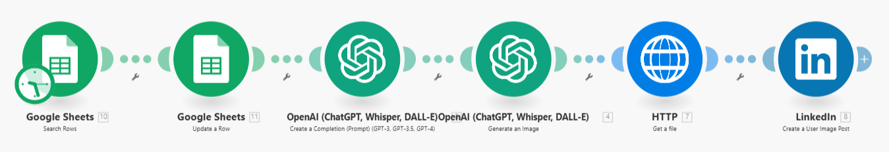
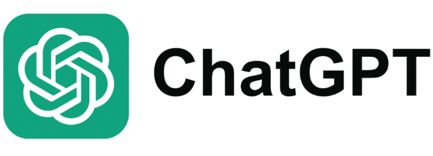

# 📢 Automatización de Publicaciones en LinkedIn con Make.com

  

  

## 📄 Índice
1. [Introducción](#introducción)
2. [Objetivo del Proyecto](#objetivo-del-proyecto)
3. [Descripción del Proyecto](#descripción-del-proyecto)
4. [Flujo de Datos](#flujo-de-datos)
5. [Tecnologías Utilizadas](#tecnologías-utilizadas)
6. [Conclusión](#conclusión)

---

## 🖇️ Introducción.
Este proyecto automatiza la creación y publicación de contenido en LinkedIn utilizando Make.com. Conecta varias herramientas y servicios para ahorrar tiempo y dinero, optimizando el flujo de trabajo en redes sociales. Además, permite a las empresas generar contenido personalizado a partir de datos estructurados.

---

## 🎯 Objetivo del Proyecto.
El objetivo principal es:
- Automatizar la creación y publicación de contenido en LinkedIn.
- Integrar datos desde Google Sheets con ChatGPT para generar textos y DALL-E para imágenes.
- Facilitar la gestión de campañas y ahorrar recursos en tareas repetitivas.

---

## 🛠️ Descripción del Proyecto.
Esta automatización utiliza **Make.com** para orquestar el flujo de trabajo. A continuación, se detallan los módulos utilizados:

1. **Google Sheets (Módulo 1: Identificar fila no procesada):**
   - Lee una fila no procesada para extraer información como texto base o parámetros.
   - Evita procesar filas duplicadas.

2. **Google Sheets (Módulo 2: Marcar fila como procesada):**
   - Marca la fila como procesada una vez completada para evitar duplicidades en futuras ejecuciones.

3. **ChatGPT (Módulo 3: Generar texto del post):**
   - Toma la información de la fila y genera contenido creativo y optimizado para LinkedIn.

4. **DALL-E (Módulo 4: Crear imagen personalizada):**
   - Genera una imagen única para acompañar el post.

5. **HTTP (Módulo 5: Subir imagen):**
   - Carga la imagen generada a un servidor o endpoint HTTP para su publicación.

6. **LinkedIn (Módulo 6: Publicar contenido):**
   - Publica el texto y la imagen generados directamente en LinkedIn.

### Ejemplos de Aplicaciones Empresariales:
- Automatización de reportes en redes sociales.
- Generación de contenido promocional en fechas específicas.
- Creación de campañas personalizadas a partir de datos históricos.

---

## 🔀 Flujo de Datos.
A continuación, se presenta el flujo de datos de la automatización:

| **Módulo**              | **Entrada**                              | **Salida**                               | **Tecnología**       |
|--------------------------|------------------------------------------|------------------------------------------|----------------------|
| Google Sheets (Módulo 1) | Fila no procesada                       | Información para el post                 | Google Sheets API    |
| Google Sheets (Módulo 2) | Identificador de fila                   | Fila marcada como procesada              | Google Sheets API    |
| ChatGPT (Módulo 3)       | Información del módulo 1                | Texto creativo                           | OpenAI ChatGPT API   |
| DALL-E (Módulo 4)        | Texto o tema del post                   | Imagen generada                          | OpenAI DALL-E API    |
| HTTP (Módulo 5)          | Imagen del módulo 4                     | URL de la imagen subida                  | HTTP Module (Make)   |
| LinkedIn (Módulo 6)      | Texto y URL de la imagen                | Publicación en LinkedIn                  | LinkedIn API         |

---

## 💻 Tecnologías Utilizadas.
- **Google Sheets API**: Para leer y actualizar datos en hojas de cálculo.
- **OpenAI GPT y DALL-E**: Para generar texto creativo e imágenes personalizadas.
- **HTTP Module (Make.com)**: Para manejar archivos y endpoints.
- **LinkedIn API**: Para publicar contenido directamente en LinkedIn.
- **Make.com**: Plataforma central de automatización.

  

  

---

## 💻 Conclusiones.
Esta automatización simplifica la gestión de contenido en LinkedIn, ahorrando tiempo y mejorando la calidad del material publicado. Es flexible y escalable, permitiendo adaptarse a otros casos de uso como campañas de marketing, reportes automatizados y más.

¡Aprovecha el poder de Make.com para transformar tu flujo de trabajo! 🚀